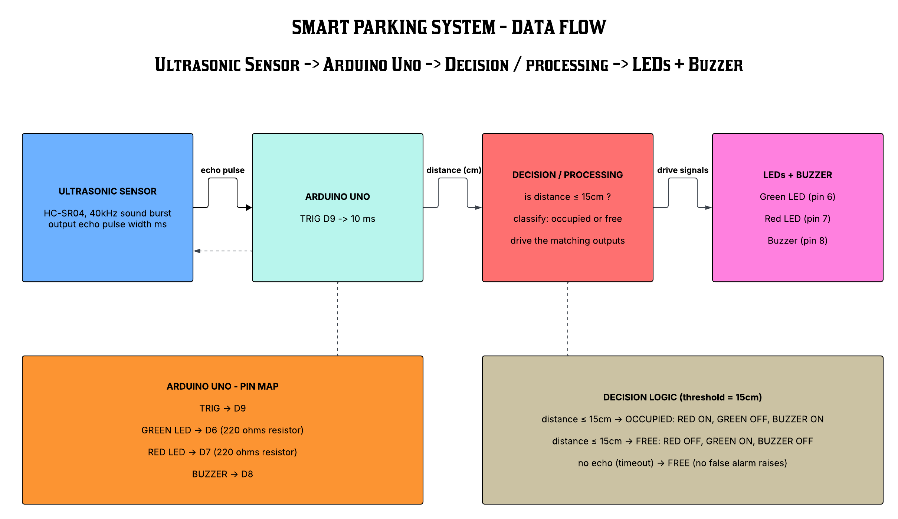
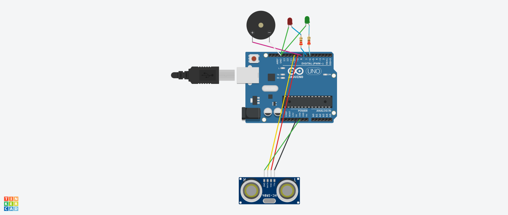

# Q4 => Arduino-Based Smart Parking System

## 1. What the system does

A shopping-centre parking bay is monitored by an HC-SR04 ultrasonic sensor mounted
at the far end of the space, facing the entrance. An Arduino Uno measures the
distance to whatever sits in front of the sensor and turns that measurement into a
simple decision:

- a vehicle is **within 15 cm** of the sensor, so the bay is **OCCUPIED** → red LED
  on, green LED off, buzzer sounding;
- nothing is that close, so the bay is **FREE** → green LED on, red LED off, buzzer
  silent.

A driver approaching the bay therefore needs to see only a colour, and the buzzer
gives an audible confirmation that the bay has detected a vehicle.

## 2. Block diagram => the flow of data



The brief requires the data flow to be shown explicitly, and it is the spine of the
whole design:

```
HC-SR04 Ultrasonic Sensor  ->  Arduino Uno  ->  Decision / Processing  ->  LEDs + Buzzer
       (measure)                  (convert)          (compare)                (act)
```

Each arrow in that chain carries a concrete value, not an abstraction:

- sensor → Arduino: an **echo pulse width** in microseconds;
- Arduino → decision: a **distance** in centimetres;
- decision → outputs: **drive signals** to three pins.

## 3. The role of each component

**HC-SR04 ultrasonic sensor (VCC 5 V, TRIG D9, ECHO D10, GND)**
The sensor is the measuring device. It contains a transmitter that emits a short
burst of 40 kHz ultrasound when commanded, and a receiver that detects the
returning echo. It converts "how far away is the object" into a **time** => the
width of the pulse it puts out on its ECHO pin. It performs no decision-making of
its own: it only reports how long the sound took to come back.

**Arduino Uno (the controller)**
The Arduino is both the timing source and the decision-maker, which is why it sits
in the middle of the data flow:

- it *commands* the sensor by generating the trigger pulse on D9;
- it *measures* the sensor's reply by timing the echo pulse on D10;
- it *converts* that time into a distance in centimetres;
- it *decides* whether the distance means "occupied" or "free";
- it *drives* the three output devices accordingly.

It is the only component that holds the state and applies the rule.

**Green LED (D6, through a 220 Ω resistor to GND)**
The "space available" indicator. It is lit when the bay is free, so a driver
scanning the row can identify an empty bay at a glance without reading anything.

**Red LED (D7, through a 220 Ω resistor to GND)**
The "space occupied" indicator. It is lit when a vehicle is detected in the bay.
The green and red LEDs are always driven as a *pair*, never independently, so the
bay can never show two contradictory colours at once.

**Piezo buzzer (D8, other lead to GND)**
The audible alert. It sounds while a vehicle is detected within the threshold. It
serves a different purpose from the LEDs: the LEDs report *state* and stay on, while
the buzzer draws attention to the moment the bay *changes* to occupied => useful for
a driver who is paying attention to traffic rather than to the indicators.

**220 Ω resistors (one per LED)**
Current limiting. An LED connected straight across 5 V would draw far more current
than it can survive and would be destroyed within seconds. With V_forward ≈ 2 V for
a red LED, the resistor holds the current to
`(5 V − 2 V) / 220 Ω ≈ 13.6 mA`, which is comfortably under the ATmega328P's 20 mA
per-pin limit and gives a bright, long-lived LED. (A piezo buzzer draws so little
current that it is driven directly.)

### Pin map

```
Component          Arduino Uno pin   Direction from the Arduino
-----------------  ----------------  --------------------------
HC-SR04 TRIG       D9                output  (Arduino -> sensor)
HC-SR04 ECHO       D10               input   (sensor  -> Arduino)
Green LED          D6                output
Red LED            D7                output
Buzzer             D8                output
```

## 4. How the sensor data is processed

The conversion from "something is 8 cm away" to "the bay is occupied" happens in
four steps, written as the function `measureDistanceCm()`.

**Step 1 => the Arduino triggers the sensor.** The TRIG pin is held LOW for 2 µs to
guarantee a clean rising edge, then taken HIGH for exactly 10 µs. That 10 µs pulse
is the command that tells the HC-SR04 to emit its burst of 40 kHz ultrasound.

**Step 2 => the sensor answers with a pulse.** The HC-SR04 raises its ECHO pin HIGH
and keeps it HIGH for the *entire round trip* => the time the sound takes to travel
out to the object and bounce back.

**Step 3 => the Arduino times that pulse.** `pulseIn(ECHO_PIN, HIGH, 30000UL)`
returns the width of the echo pulse in microseconds. The third argument is a 30 ms
timeout, which corresponds to roughly 5 m of range => more than enough for a single
parking bay, and it stops the program hanging if nothing ever echoes back.

**Step 4 => time is converted into distance.** The measured time covers the journey
*out and back*, so it represents **twice** the true distance, and the speed of
sound has to be expressed in units that match microseconds:

```
speed of sound at ~20 °C  =  343 m/s  =  34300 cm/s  =  0.0343 cm per µs

distance (cm)  =  (echo_pulse_width_µs  ×  0.0343)  /  2
                                                  ^
                                    divided by 2 because the sound travelled
                                    to the object AND back again
```

Worked examples, using exactly the arithmetic in the sketch:

```
echo pulse    calculation                        distance    decision
-----------   --------------------------------   ---------   ----------
   466 µs     466 × 0.0343 / 2 = 7.99 cm          7.99 cm    OCCUPIED  (≤ 15)
   875 µs     875 × 0.0343 / 2 = 15.01 cm        15.01 cm    OCCUPIED  (≤ 15)
  3498 µs    3498 × 0.0343 / 2 = 59.99 cm        59.99 cm    FREE      (> 15)
```

**Step 5 => the decision.** The distance is compared with the threshold constant:

```c
bool occupied = (distance != NO_ECHO && distance <= OCCUPIED_THRESHOLD_CM);
```

**Why 15 cm is the right threshold.** The sensor looks along the length of the bay.
A car that has driven fully into the space finishes up roughly 10–15 cm from the
sensor face, so any reading at or below 15 cm means a car is present. An empty bay
offers no reflecting surface that close => the nearest echo comes from the far wall,
the kerb or the road beyond, all of which are metres away => so an empty bay reads
far above 15 cm. The threshold therefore sits in a wide, unambiguous gap between
"car parked" and "no car", which means it also tolerates a car that is not perfectly
positioned. It is defined once as `OCCUPIED_THRESHOLD_CM` so it can be tuned in a
single place without touching the logic.

**Handling a failed measurement.** If `pulseIn()` times out it returns 0, and
`measureDistanceCm()` converts that into the sentinel `NO_ECHO` (−1) rather than
inventing a distance of 0 cm. The decision then treats it as FREE. This matters: a
sensor that is unplugged, obstructed or simply fails to echo must not leave a false
"OCCUPIED" alarm buzzing all day. Distinguishing "no reading" from "a reading of
zero" is what makes that safe.

**A note on the speed of sound.** The constant 0.0343 cm/µs assumes air at about
20 °C. Sound speed changes by roughly 0.6 m/s per °C, so across a 0 °C to 40 °C
range the figure moves by under 2 %. At a 15 cm threshold that is a shift of less
than 3 mm => far smaller than the margin around the threshold, so no temperature
compensation is needed for this application.

## 5. How the Arduino controls the outputs

All three output devices are driven from one function, `updateIndicators()`, so the
outputs can never disagree with each other or with the decision:

```c
void updateIndicators(bool occupied) {
  if (occupied) {
    digitalWrite(GREEN_LED_PIN, LOW);   /* green off */
    digitalWrite(RED_LED_PIN, HIGH);    /* red   on  */
    tone(BUZZER_PIN, ALERT_TONE_HZ);    /* beep      */
  } else {
    digitalWrite(GREEN_LED_PIN, HIGH);  /* green on  */
    digitalWrite(RED_LED_PIN, LOW);     /* red   off */
    noTone(BUZZER_PIN);                 /* silent    */
  }
}
```

**Controlling the LEDs => `digitalWrite()`.** A digital pin is switched between two
states: `HIGH` (about 5 V) and `LOW` (0 V). Because each LED is wired
anode → 220 Ω resistor → pin, with the cathode to ground:

- `HIGH` → current flows from the pin through the resistor and the LED to ground →
  the LED conducts and lights;
- `LOW` → both ends of the LED sit at 0 V → no current → the LED is dark.

Both LEDs are written on *every* pass, one HIGH and the other LOW, so they are
mutually exclusive by construction. There is deliberately no code path that touches
one LED without also setting the other.

**Controlling the buzzer => `tone()` and `noTone()`.** A piezo element needs an
oscillating signal, not a steady voltage; holding a DC level across it produces no
sound and can damage it. `tone(BUZZER_PIN, 1000)` makes the Arduino generate a
1 kHz square wave on D8, which drives the piezo at an audible, attention-getting
pitch. `noTone(BUZZER_PIN)` stops the waveform and returns the pin to silence.
Unlike the LEDs, the buzzer is an alert rather than a status indicator, so it is
deliberately the loudest and most intrusive of the three outputs.

**The loop that ties it together.** `loop()` runs the whole cycle about three times
a second and keeps the three stages clearly separated, so the sketch reads as the
data flow in the block diagram:

```
loop():
   1. READ    distance = measureDistanceCm()      -> the sensor stage
   2. DECIDE  occupied = (distance <= 15 cm)      -> the decision stage
   3. ACT     updateIndicators(occupied)          -> the output stage
   4. REPORT  print the reading to the Serial Monitor, for demonstration
```

Putting the decision in `loop()` and the actions in `updateIndicators()` is what
keeps the design testable: the decision table in §7 can be checked by supplying
distances, without needing to observe LEDs.

### Output truth table

```
Condition                     GREEN LED   RED LED   BUZZER    Bay status
---------------------------   ---------   -------   -------   ----------
distance >  15 cm                 ON        off       off     FREE
distance <= 15 cm                off         ON        ON     OCCUPIED
no echo / sensor timeout          ON        off       off     FREE (fail safe)
```

## 6. Simulation test cases

Two test cases are required; both are listed below with the expected result, and
both were confirmed.

**TEST 1 => vehicle outside the threshold (bay empty).** Set the sensor's distance to
about 60 cm.

```
Green LED ON,  Red LED OFF, Buzzer OFF
Serial: Distance: 59.99 cm  |  Status: FREE  (Green LED ON, Red LED OFF, Buzzer OFF)
```

**TEST 2 => vehicle within the threshold (bay occupied).** Move the sensor's distance
to about 8 cm.

```
Green LED OFF, Red LED ON,  Buzzer ON
Serial: Distance: 7.99 cm  |  Status: OCCUPIED  (Red LED ON, Green LED OFF, Buzzer ON)
```

### Full verified behaviour

The decision logic in `smartparking.ino` cannot be watched on a PC, so the sketch
was compiled against a stand-in Arduino API with a simulated sensor
(`docs/evidence/q4_sim_test.cpp`, run with g++). Every pin write was recorded and
checked against the truth table:

```
mocked distance                    expected   GREEN   RED    BUZZER   result
--------------------------------   --------   -----   ----   ------   --------
-1 (no echo / sensor timeout)      FREE       ON      off    off      PASS
 0.0 cm  (pulseIn times out)       FREE       ON      off    off      PASS
 1.0 cm  (vehicle at the sensor)   OCCUPIED   off     ON     ON       PASS
 8.0 cm  (TEST 2 - vehicle in bay) OCCUPIED   off     ON     ON       PASS
14.9 cm  (just inside threshold)   OCCUPIED   off     ON     ON       PASS
15.0 cm  (exactly at threshold)    OCCUPIED   off     ON     ON       PASS
15.1 cm  (just outside threshold)  FREE       ON      off    off      PASS
20.0 cm                            FREE       ON      off    off      PASS
60.0 cm  (TEST 1 - bay empty)      FREE       ON      off    off      PASS
150.0 cm (car far away)            FREE       ON      off    off      PASS

10 cases, 0 failures
```

The two boundary cases at 15.0 cm and 15.1 cm are the important ones: they prove the
threshold behaves exactly as the rule states (`<= 15 cm` is occupied) rather than
being off by one.

## 7. Circuit design (Tinkercad)

The circuit was built and simulated in Tinkercad Circuits using an Arduino Uno, one
HC-SR04 ultrasonic distance sensor, two LEDs (green and red) each with a 220 Ω
resistor, and one piezo buzzer, wired per the pin map in §3. 


---

## Deliverables checklist for Question 4

- [x] Tinkercad circuit design showing all components and connections => §3, `Q4-SmartParking/docs/evidence/ParkingSysCircuit.png`
- [x] Block diagram showing the flow of data through the system => §2, `Q4-SmartParking/docs/evidence/BLOCK DIAGRAM- Cprogramming.png`
- [x] Arduino source code used in the simulation => `smartparking.ino`
- [x] At least two simulation test cases => §6, plus a 10-case verified decision table
- [x] Short explanation: role of each component, how sensor data is processed, how the Arduino controls the outputs => §3, §4, §5
